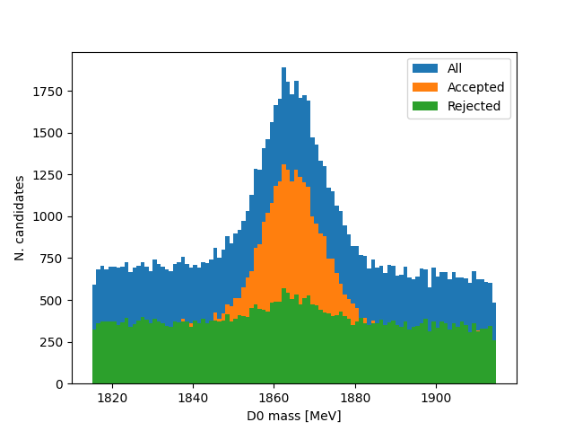

# SUPAPYT 2021 assignment

The file [here](D0KpiData.csv) contains data recorded by the [LHCb experiment](https://lhcb-public.web.cern.ch/) at CERN and shared via the [CERN Open Data Portal](https://opendata.cern.ch/record/401). It contains information on 88,540 reconstructed decays of the D0 meson decaying to a kaon and a pion. The D0 meson contains the heavy charm quark and so decays in a very short, but non-zero, time. The assignment is to use this data to measure the lifetime of the D0 meson using python with only functionality from the [Standard Library](https://docs.python.org/3/tutorial/stdlib.html) (so no `numpy`, `pandas`, etc - the full list of allowed modules is [here](https://docs.python.org/3/library/index.html)).

The reconstructed candidates are a mixture of signal and background. There are four columns in the dataset:

- `mass`: the reconstructed mass of the D0 in MeV. This follows a Gaussian distribution for signal and a flat distribution for background.
- `decaytime`: the reconstructed proper decay time of the D0 in picoseconds [ps]. This follows an exponential distribution for signal and a complicated distribution for background. The mean decay time for signal gives the lifetime.
- `pt`: the transverse momentum of the D0 in MeV. This is expected generally to be larger for signal than for background.
- `ipchi2`: the impact parameter chi-squared of the D0, which is unitless. This is a measure of how compatible the D0 is with having originated in the pp collision provided by the LHC. It's thus expected to be smaller for signal than for background (which can originate from other processes).

The goal is to remove as much background as possible while retaining as much signal as possible, then subtract the remaining background and calculate the mean decay time of the signal, which gives the lifetime.

In order to achieve this, write a script/module/package in python, using only [Standard Library](https://docs.python.org/3/library/index.html) functionality, to do the following:

1. Read in the [data file](D0KpiData.csv) (the [`csv`](https://docs.python.org/3/library/csv.html) module can help with this). Find the minimum, maximum, mean and standard deviation of the values in the `mass` column and output these to the terminal.
	- You're not required to do any visualisation of the data as the Standard Library doesn't contain any histogramming functionality, but if you like (for no extra credit) you can install `matplotlib` and make a histogram of the masses with, eg
```
from matplotlib import pyplot as plt
histo = plt.hist(masses, bins = 100)
plt.xlabel('D0 mass [MeV]')
plt.ylabel('N. candidates')
plt.show()
```
	where `masses` is the sequence of mass values from the data file. You'll get something like this:


so you can see that the Gaussian bump in the middle is the signal, and the background is fairly flat across the whole range.

2. Similarly find and output the minimum, maximum, mean and standard deviation of the `decaytime` values. 
	- There's a cut-off at low decay time values as this region is dominated by backgrounds. To get the lifetime, you need to subtract the minimum from the mean. This actually gives something remarkably close to the [known D0 lifetime](https://pdglive.lbl.gov/DataBlock.action?node=S032T&home=MXXX035) of 0.4101 +/- 0.0015 ps. However, the standard deviation of an exponential distribution should be the same as its mean, and in this case they're very different as the backgrounds are skewing the data. You can see that if you plot the decay time with `matplotlib` and use a log scale that its distribution clearly isn't a simple exponential (which would be a straight line on a log scale):
	


- This is why we need to subtract the background distribution.
	
3. The regions near the edges of the mass distribution are entirely background. Since the background is flat in mass we can use these regions to estimate the number of background under the signal peak, and thus the number of signal.
	- Taking the values found in problem 1, define the background regions to be
	
	`min <= mass and mass < min + stddev*0.8`
	
	and 
	
	`max - stddev*0.8 <= mass and mass < max`, 
	
	where `min` and `max` are the minimum and maximum of the masses and `stddev` their standar deviation. Count the number of candidates in the dataset that fall in either of these regions to give the number of background and output this.
	- Define the signal region to be
	
	`mean - stddev*0.8 <= mass and mass < mean + stddev*0.8`,
	
	where `mean` is the mean of the masses. Count the number of candidates in this region to get the number of signal plus background. Subtract from this the number of background to get the number of signal and output this.
	- This is a technique known as sideband subtraction. The factor of 0.8 is required so that the regions don't overlap.
   
4. Next we want to reduce the background as much as possible. As said previously, we expect the `ipchi2` values to be smaller for signal than for background, so we can discard candidates with `ipchi2` above a certain value.
	- Divide the candidates in the dataset into two sets: one with `ipchi2 < 13` and one with `ipchi2 >= 13`.
	- Using the same technique as in problem 3 (still using the values from problem 1 to define the mass regions), find the number of signal and the number of background for each of the two datasets and output these.
	- You should see that the dataset with `ipchi2 >= 13` is almost entirely background, so we can discard it.
   
5. Similarly, we expect `pt` values generally to be higher for signal than for background, so we can discard candidates with `pt` less than a certain value.
	- Take the dataset with `ipchi2 < 13` and find the minimum value of `pt`.
	- Select candidates with `pt > (pt min.) + 10` and (using the method from problem 3) determine the number of signal and background.
	- Determine the "signal significance" as 
	
	`(nsignal)/(nsignal + 2*(nbackground))**.5`,
	
	where `nsignal` is the number of signal, and `nbackground` the number of background.
	- Continue to increase the minimum requirement on `pt` in steps of 10 (ie, `pt > (pt min.) + 20`, `pt > (pt min.) + 30`, etc) up to 100 steps (`pt > (pt min.) + 1000`). At each step, re-evaluate the number of signal and background, and the signal significance.
	- Find the minimum requirement on `pt` that gives the maximum value of the signal significance. Output the requirement value and the signal sigificance.
	- Keep only candidates that satisfy this requirement.
	- We now have only candidates with `ipchi2 < 13 and pt > (optimal value)`. In order to see the effects of this, you could plot the mass distribution for the candidates we've kept and the candidates we've discarded, which looks like this:
	


- You can see that there's hardly any signal peak in the candidates that we've rejected, so we've thrown away almost entirely backgrounds.
	
6. Having cleaned up our data, we can now determine the lifetime.
	- Take the dataset with `ipchi2 < 13 and pt > (optimal value)`.
	- Take the minimum and maximum decay-time values from problem 2 and calculate a decay-time interval width `delta = (max - min)/100`.
	- Divide the data into 100 datasets each with a different decay-time interval 
	
	`min + i*delta <= decaytime and decaytime < min + (i+1)*delta` 
	
	for `i` between 0 and 99.
	- For each of the 100 datasets, calculate the number of signal (using problem 3) and the middle of the decay-time interval `min + (i+0.5)*delta`. This gives us the decay-time distribution only for signal (having subtracted the background).
	- Calculate the mean decay time for signal as 

	`mean = sum(nsignal[i] * decaytime[i])/sum(nsignal[i])`
	
	and the mean decay time squared as
	
	`meansq = sum(nsignal[i] * decaytime[i]**2)/sum(nsignal[i])`,
	
	where `nsignal[i]` is the number of signal in decay-time interval `i` and `decaytime[i]` is the middle of the decay-time interval for interval `i`.
	- Calculate the lifetime of the signal as `mean - min`, as in problem 2. Also calculate the standard deviation as `(meansq - mean**2)**.5` and check that this agrees with the measured lifetime (within 0.005 ps).
	- This gives us a measurement of the lifetime of the D0 that should agree with [known D0 lifetime](https://pdglive.lbl.gov/DataBlock.action?node=S032T&home=MXXX035) of 0.4101 +/- 0.0015 ps within around 0.01 ps! Not bad for such a simple analysis method.
	- In `matplotlib`, you could plot the signal decay-time distribution with, eg:
```
plt.clf()
hsig = plt.plot(timevals, nsigvals)
plt.xlabel('D0 decay time [ps]')
plt.ylabel('Yield')
plt.yscale('log')
plt.show()
```
	where `timevals` is the sequence of middle decay-time values, and `nsigvals` is the sequence of number of signal in each interval.
	- If you also do the same for the background you get something like this:


so you can see that the signal distribution is a nice exponential (straight line on log scale), and that the remaining background tends to have lower decay times.
	
That's it! Hopefully all the steps are clear. Please [email me](mailto:michael.alexander@glasgsow.ac.uk) if not.

If you want an extra challenge (but no extra credit), you could try to evaluate an uncertainty on the lifetime we've obtained (in which case I'd recommend installing and using the `uncertainties` package), or you could check out [Project Euler](https://projecteuler.net/).
